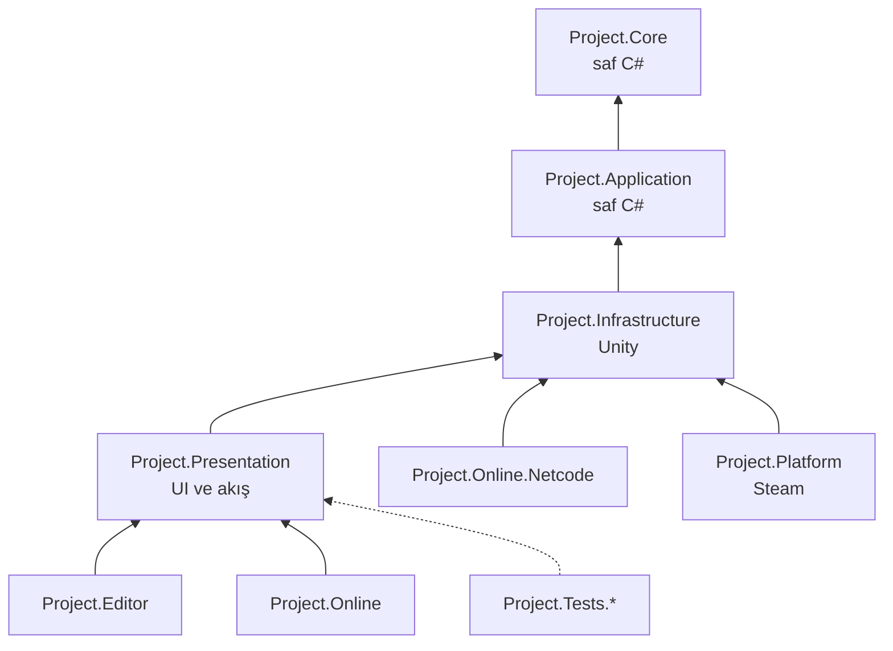
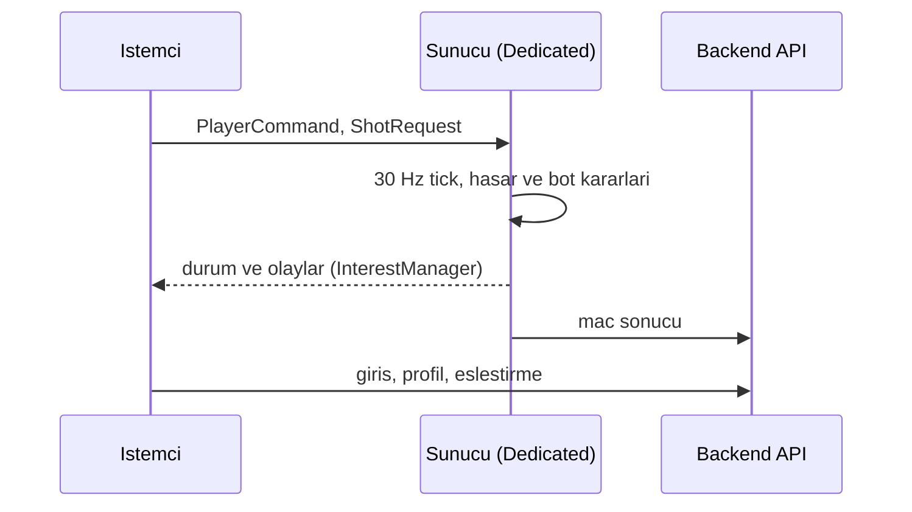
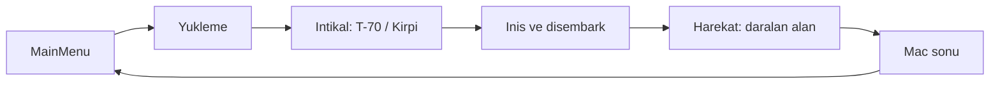
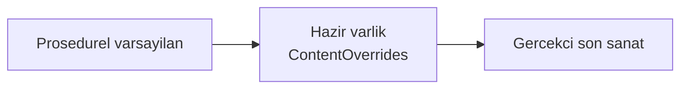
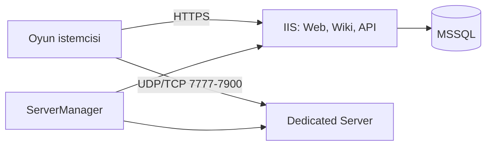

# HAREKÂT Mimari

Katmanlı, **sunucu otoriteli** tasarım: oyun kuralları saf C# katmanlarında, Unity bağımlılığı dış katmanlarda. Sözleşme ayrıntıları: [Docs/CONTRACTS.md](Docs/CONTRACTS.md).

## Katmanlar ve derlemeler (asmdef)

| Derleme | Kök | Bağımlılık | Not |
|---------|-----|-----------|-----|
| `Project.Core` | `Scripts/Core` | yok | Alan modeli (`PlayerId`, `Float3`, `PlayerCommand`, `ShotRequest`), olaylar, arayüzler |
| `Project.Application` | `Scripts/Application` | Core | Servisler ve kataloglar; Unity yok, test edilebilir |
| `Project.Infrastructure` | `Scripts/Infrastructure` | Core, Application, InputSystem, URP | Combatant, balistik, bot, dünya, ses, araç, DI, içerik |
| `Project.Presentation` | `Scripts/Presentation` | Infrastructure, UGUI | Bootstrap, oyuncu, HUD, menü, harita, DevTools |
| `Project.Editor` | `Scripts/Editor` | tümü | Kurulum, sahne üretimi, build, varlık eşleyici |
| `Project.Online` | `Scripts/Online` | Presentation | `BackendClient`, profil, eşleştirme arayüzleri |
| `Project.Online.Netcode` | `Scripts/Online/Netcode` | Infrastructure, Netcode for GameObjects | Sunucu, istemci tahmini, gecikme telafisi |
| `Project.Platform` | `Scripts/Platform` | Core, Application, Infrastructure, Steamworks.NET | Steam başarım ve zengin durum |
| `Project.Tests.EditMode` / `PlayMode`, `Project.Online.Tests` | `Tests/*`, `Online/Tests` | ilgili katmanlar | NUnit |

Kural: bağımlılık yalnızca aşağı yönlüdür; Core ve Application motor-bağımsız kalır.

## Sunucu otoriteli tasarım

- **`PlayerCommand`**: tick, ileri/yan hareket, yaw/pitch, düğme bayrakları, silah seçimi. İstemci girdisi bu yapıyla taşınır.
- **`SimulationClock`**: sabit **30 Hz** tick; `Advance(dt)` o karede çalışacak tick sayısını verir. `GameTickCoordinator` servisleri tick'e bağlar.
- **`INetworkSession`**: `Role`, `HasAuthority`, `LocalPlayerId`, `StartHost/StartClient/StartServer/Disconnect`. Çevrimdışı `OfflineNetworkSession` her zaman otoritedir; çevrimiçi `NetcodeNetworkSession`.
- **`ShotRequest`**: atıcı, silah, başlangıç, yön ve tick; sunucu isabeti doğrular (`LagCompensationBuffer`, `InterestManager`).
- **Otorite kuralı:** hasar, envanter ve yapay zekâ yalnızca `GameContext.Network.HasAuthority` olan yerde değişir. Sunum katmanı olaylara tepki verir.

## Olay veri yolu (`IEventBus`)

`PlayerDamagedEvent`, `PlayerDiedEvent`, `HitConfirmedEvent`, `WeaponFiredEvent`, `WeaponReloadStartedEvent`, `WeaponReloadedEvent`, `LootPickedUpEvent`, `ItemUsedEvent`, `ExplosionEvent`, `ZoneStageChangedEvent`, `MatchPhaseChangedEvent`, `MatchEndedEvent`, `SquadOrderIssuedEvent`, `ArtilleryStrikeEvent`, `CommandTransferredEvent`.

## Kompozisyon kökü

`GameSession` (statik oturum: mod, `MatchConfig`, ayarlar, kariyer) sahneyi seçer. `GameCompositionRoot.Build` bir `ServiceContainer` kurar; servisler `GameContext.Get<T>()` ile erişilir (sahne kapsamlı). Kaydedilenler: olay yolu, rastgele, `SimulationClock`, `GameTickCoordinator`, `MatchService`, `ZoneService`, `CombatService`, `DamageableRegistry`, `LootSpawnService`, istatistik, öldürme akışı, `SquadOrderService`, `ArtilleryService`, `ChainOfCommandService`, `INetworkSession`, ayarlar, kariyer. Sahne girişleri: `MainMenuBootstrap`, `MatchBootstrap` (KuzgunVadisi), `TrainingBootstrap`.

## Maç akışı

Oyuncu ve botlar araçta oturur, iniş noktasında inerler; `MatchService` fazları yayınlar, `ZoneService` aşamalı daralır.

## Dünya üretim hattı

`MapLayout.CreateKuzgunVadisi(seed)` yerleşim verisi verir. `WorldGenerator.Generate` sırasıyla: `TerrainGenerator` (arazi, yollar, dere, göl), `LocationBuilder` + `BuildingGenerator` + `PropFactory` (köyler, binalar, dekor, loot noktaları), `MinimapTextureGenerator`, `NavMeshBaker`. Sonuç `WorldMetadata` içinde toplanır (yükseklik örnekleme, loot/araç/iniş noktaları, mini harita). `TrainingRangeBuilder` poligonu kurar.

## İçerik geçersiz kılma hattı

Her şey önce kodla üretilir. **Varlık Eşleyici** (editör) CSV'lerden (`Design/Assets/*.csv`) `ContentOverrides` oluşturur; kimlik bulunursa hazır model/doku/ses kullanılır, bulunamazsa prosedürel kalır. Böylece oyun varlıksız da çalışır.

## Backend ve Windows dağıtımı

- **Backend** (`Backend/`): ASP.NET Core API (`Harekat.Api`), Application/Domain/Infrastructure, MSSQL (varsayılan sağlayıcı), telemetri, `Harekat.ServerManager` (dedicated server süreçlerini 7777-7900 aralığında başlatır).
- **Dağıtım** (`Deploy/windows`): IIS üzerinde web (80/443), wiki (3210), API (3208, ASP.NET Core Module V2); SQL Server 1433; `deploy.ps1`, `iis-setup.ps1`, `firewall.ps1`.
- **Web** ve **Wiki** düz statik dosyalardır, IIS `web.config` ile sunulur.
- **İstemci dağıtımı:** Windows build, Inno Setup paketi, Launcher.

