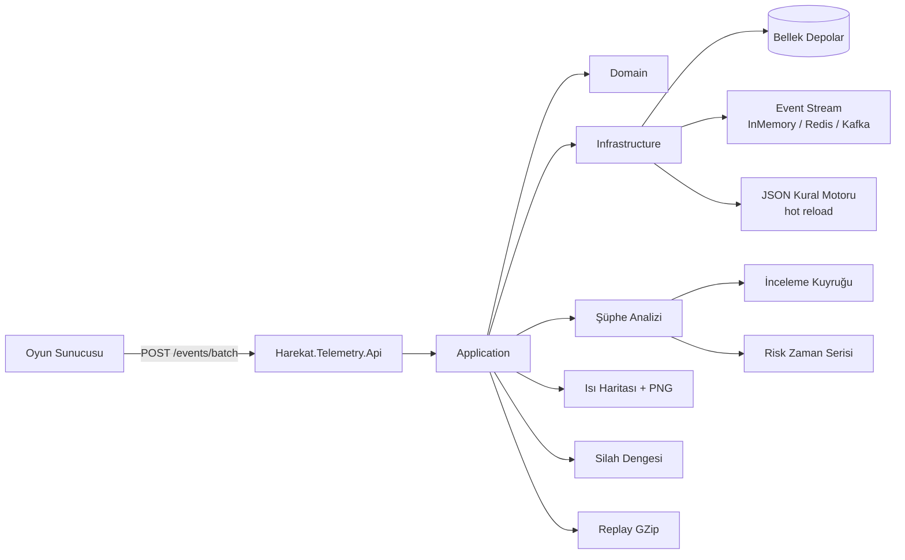
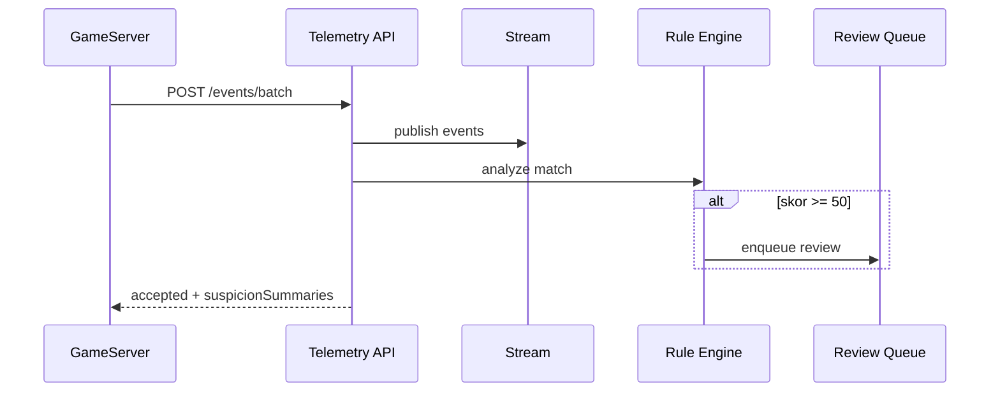

# HAREKÂT Telemetri ve Hile Tespiti

`.NET 10` tabanlı, bağımsız telemetri servisi. Maç olaylarını toplar, şüpheli davranış kurallarını uygular, ısı haritası / silah dengesi / risk skoru üretir.

**Klasör kısıtı:** Yalnızca `Backend/Harekat.Telemetry/` altında yaşar; kendi `Harekat.Telemetry.sln` dosyası vardır.

## Mimari



```
Harekat.Telemetry/
├── Harekat.Telemetry.sln
├── README.md
├── rules/detection-rules.json
├── src/
│   ├── Harekat.Telemetry.Domain/
│   ├── Harekat.Telemetry.Application/
│   ├── Harekat.Telemetry.Infrastructure/
│   └── Harekat.Telemetry.Api/
└── tests/Harekat.Telemetry.Tests/
```

## Hızlı başlangıç

```bash
cd Backend/Harekat.Telemetry
dotnet restore
dotnet build
dotnet test --collect:"XPlat Code Coverage"
dotnet run --project src/Harekat.Telemetry.Api
```

Swagger: `http://localhost:5xxx/swagger`

## Ana API

| Metod | Yol | Açıklama |
|-------|-----|----------|
| POST | `/events/batch` | Kill / hit / death / shot / landing toplu olay |
| GET | `/reports?minScore=` | Şüphe skorları ve bulgular |
| GET | `/heatmap/{matchId}` | 10 m grid ölüm/iniş hücreleri |
| GET | `/heatmap/{matchId}/png` | Kuzgun Vadisi PNG (−512..512) |
| GET | `/heatmap/season/{id}/png` | Sezonluk karşılaştırma PNG |
| GET | `/weapons/balance` | Silah K/D, mesafe, TTK |
| GET | `/players/{id}/risk` | Risk skoru zaman serisi |
| GET/PATCH | `/review-queue` | Otomatik inceleme kuyruğu |
| POST/GET | `/replays` | `harekat-replay-v1` + GZip |
| GET | `/rules` | Aktif kural seti |
| GET | `/health`, `/metrics/perf` | Sağlık + performans |

### Örnek batch

```json
{
  "matchId": "match-42",
  "events": [
    { "playerId": "p1", "eventType": "Shot", "weaponId": "ar_mpt76", "x": 10, "y": 1, "z": -20 },
    { "playerId": "p1", "eventType": "Hit", "weaponId": "ar_mpt76", "isHeadshot": true, "throughWall": false },
    { "playerId": "p2", "eventType": "Death", "x": 12, "y": 1, "z": -18 },
    { "playerId": "p3", "eventType": "Landing", "x": -100, "y": 80, "z": 200 }
  ]
}
```

## Silah kimlikleri (Unity ile aynı)

`pistol_sar9`, `pistol_tp9`, `smg_sar109t`, `ar_mpt55`, `ar_mpt76`, `ar_g3a7`, `dmr_knt76`, `sr_jng90`, `lmg_pmt76`, `sg_escort`

## Şüphe kuralları

`rules/detection-rules.json` — JSON ile tanımlı, dosya değişince **hot reload**:

| Kural | Varsayılan eşik | Skor |
|-------|-----------------|------|
| ImpossibleHitRate | ≥20 atış ve isabet ≥ %85 | 35 |
| HighHeadshotRate | ≥10 isabet ve HS ≥ %70 | 30 |
| ImpossibleSpeed | yatay hız ≥ 18 m/s | 40 |
| WallbangConsistency | ≥5 duvar isabeti ve oran ≥ %40 | 35 |

Toplam skor ≥ **50** → inceleme kuyruğuna alınır.

## Uzatmalar

1. **Akış soyutlaması:** `Streaming:Backend` = `InMemory` | `RedisStreams` | `Kafka`
2. **Kural motoru hot reload:** `RuleEngine:EnableHotReload`
3. **Risk zaman serisi + inceleme kuyruğu:** otomatik enqueue / PATCH status
4. **Silah dengesi:** K/D, ortalama mesafe, TTK p50/p95/p99
5. **Isı haritası PNG:** Kuzgun Vadisi −512..512, 10 m grid
6. **Replay:** `harekat-replay-v1` JSON + GZip

## Veri akışı



## Performans

- Batch üst sınırı: **5000** olay
- `/metrics/perf`: ortalama ve p95 ingest/analiz süreleri
- `/debug/bench`: 1000 olay duman testi

## Hata yönetimi

- Geçersiz `WeaponId`, eksik konum, boş batch → 400 ProblemDetails
- Bilinmeyen replay / queue kaydı → 404
- Kısmi batch: geçerli olaylar kabul, hatalar `errors[]` içinde

## Test

```bash
dotnet test --collect:"XPlat Code Coverage"
```

Hedef: satır kapsamı **%80+** (Domain + Application + Infrastructure çekirdeği).
