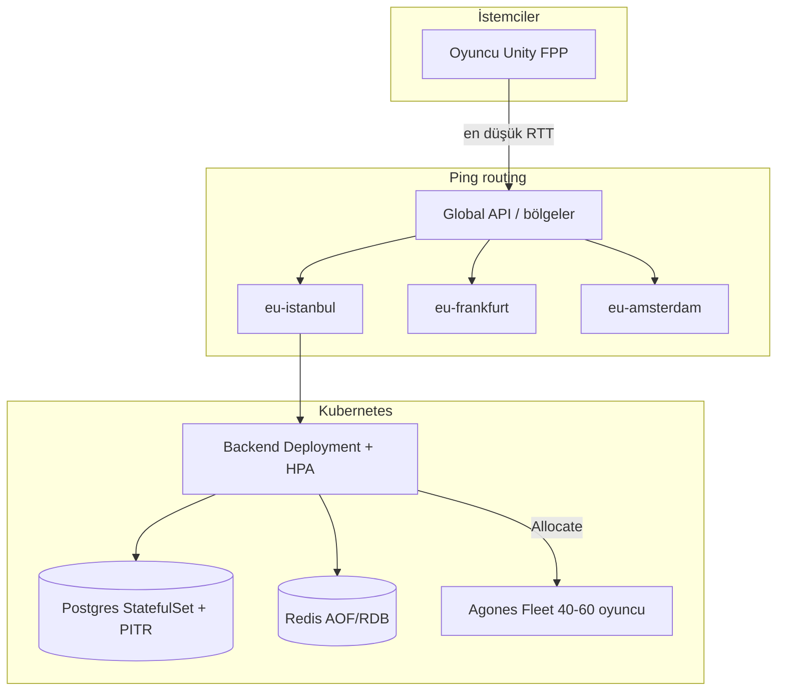
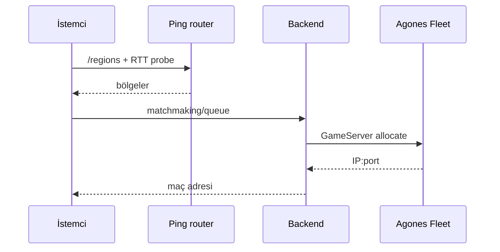

# HAREKÂT — Dedicated Server Filosu ve Dağıtım

Türk askeri temalı FPP tim battle royale (**10 kişilik tim**, maç başına **40–60 oyuncu**) için Kubernetes + Agones + Terraform iskeleti. Hedef: **binlerce eşzamanlı oyuncu**.

> Bu klasör dışında dosya yazılmaz. Backend imajı `Backend/` (GÖREV 1), Unity build GÖREV 5 CI ile üretilir.

---

## Mimari





---

## Kapasite hesabı

| Parametre | Değer |
|-----------|--------|
| Tim | 10 oyuncu |
| Maç | 40–60 oyuncu (ort. 50) |
| Sunucu | Maç başına 1 Agones GameServer |
| Kaynak / sunucu | 1–2 vCPU, 2–4 GiB RAM |
| Node | ~2 GameServer / `e2-standard-4` |

**Formül:** `sunucu ≈ CCU/50 + 5 buffer`, `node ≈ ceil(sunucu/2)`.

| CCU | Maç | Sunucu | Node (≈) | IST / FRA / AMS |
|-----|-----|--------|----------|-----------------|
| 500 | 10 | 15 | 8 | 8 / 4 / 3 |
| 1.000 | 20 | 25 | 13 | 12 / 7 / 6 |
| 2.500 | 50 | 55 | 28 | 25 / 15 / 15 |
| 5.000 | 100 | 105 | 53 | 45 / 30 / 30 |
| 10.000 | 200 | 205 | 103 | 90 / 60 / 55 |

Ayrıntı: [`docs/capacity.md`](docs/capacity.md).

---

## Maliyet tahmini (USD/ay, yaklaşık)

%70 spot GameServer + gece ölçek (~%25 tasarruf), GCP `europe-west3`:

| CCU | On-demand | Spot | Aylık compute | Gece tasarruf |
|-----|-----------|------|---------------|---------------|
| 500 | ~3 | ~5 | ~$250 | ~$80 |
| 1.000 | ~4 | ~9 | ~$400 | ~$130 |
| 2.500 | ~9 | ~19 | ~$900 | ~$300 |
| 5.000 | ~16 | ~37 | ~$1.700 | ~$550 |
| 10.000 | ~31 | ~72 | ~$3.200 | ~$1.050 |

```bash
make cost-sim   # docs/cost-simulation.csv
```

---

## Klasör yapısı

```
Deploy/
├── server/Dockerfile          # Unity Linux dedicated server
├── k8s/                       # Backend, Postgres, Redis, Ingress, multi-region, secrets
├── agones/                    # Fleet, FleetAutoscaler, GameServer, bölgesel fleet
├── terraform/                 # GKE cluster + node pool (spot/ondemand)
├── scripts/                   # blue-green, rollback, dev-up, validate, cost-sim
├── monitoring/                # Grafana JSON + Prometheus alerts
├── backup/                    # PITR CronJob + DR runbook
├── docs/                      # kapasite & maliyet
└── Makefile                   # make dev-up | test | cost-sim
```

---

## Adım adım kurulum

### 0. Önkoşullar

- `kubectl`, `helm`, `docker`, `terraform` ≥ 1.5
- Yerel: `kind` veya `minikube`
- Unity Linux dedicated server build (ör. `ServerBuild/`)

### 1. Yerel geliştirme (tek komut)

```bash
cd Deploy
make dev-up                          # varsayılan: kind
# veya
CLUSTER_PROVIDER=minikube make dev-up
make test
```

API smoke: `kubectl -n harekat port-forward svc/harekat-backend 8080:80`

Yıkım: `make dev-down`

### 2. Dedicated server imajı

```bash
docker build \
  --build-arg UNITY_SERVER_BUILD_PATH=./ServerBuild \
  -t ghcr.io/harekat/dedicated-server:latest \
  -f Deploy/server/Dockerfile Deploy/server
```

Ortam değişkenleri: `GAME_PORT`, `QUERY_PORT`, `REGION`, `SERVER_KEY`, `BACKEND_URL`, `MAX_PLAYERS`, `MIN_PLAYERS`.

### 3. Bulut iskeleti (Terraform)

Sağlayıcı seçimi: [`terraform/README.md`](terraform/README.md) — varsayılan **GCP/GKE**; AWS EKS ve Azure AKS notları orada.

```bash
cd Deploy/terraform
terraform init
terraform plan  -var-file=environments/prod/terraform.tfvars
terraform apply -var-file=environments/prod/terraform.tfvars
```

Spot node pool + on-demand + backend pool oluşur.

### 4. Agones

```bash
helm repo add agones https://agones.dev/chart/stable
helm install agones agones/agones -n agones-system --create-namespace
kubectl apply -f Deploy/agones/fleet.yaml
kubectl apply -f Deploy/agones/fleet-autoscaler.yaml
# Çok bölgeli:
kubectl apply -f Deploy/agones/fleet-regions.yaml
```

### 5. Uygulama stack

```bash
kubectl apply -k Deploy/k8s
# Üretim secret'ları:
kubectl apply -f Deploy/k8s/secrets/sealed-secrets.yaml
# veya External Secrets:
kubectl apply -f Deploy/k8s/secrets/external-secrets.yaml
kubectl apply -f Deploy/backup/pitr-cronjobs.yaml
kubectl apply -f Deploy/monitoring/prometheus/alerts.yaml
```

### 6. Blue-green dağıtım / rollback

```bash
make blue-green TAG=v1.2.3
make rollback
```

### 7. Gözlemlenebilirlik

- Grafana: `monitoring/grafana/dashboards/harekat-ops.json`, `harekat-capacity.json`
- Prometheus: `monitoring/prometheus/alerts.yaml` (hata oranı, eşleşme süresi, fleet buffer, Postgres/Redis)

---

## Uzatma özellikleri (GÖREV 2)

| # | Özellik | Konum |
|---|---------|--------|
| 1 | Çok bölgeli ping routing (İstanbul/Frankfurt/Amsterdam) | `k8s/multi-region/`, `agones/fleet-regions.yaml` |
| 2 | Blue-green + rollback | `scripts/blue-green-deploy.sh`, `rollback.sh`, overlays |
| 3 | Sealed Secrets + External Secrets | `k8s/secrets/` |
| 4 | Postgres PITR, Redis persistence, DR | `backup/`, `k8s/redis`, `k8s/postgres` |
| 5 | Grafana dashboards + Prometheus alerts | `monitoring/` |
| 6 | `make dev-up` (kind/minikube) | `Makefile`, `scripts/dev-up.sh` |
| 7 | Spot nodes, gece ölçek, maliyet sim | Terraform spot pool, HPA CronJob, `make cost-sim` |

---

## Performans ölçümü

- Backend: `/metrics` + HPA (CPU %65 / bellek %75)
- Agones FleetAutoscaler: Ready buffer 5, max 200
- Gece (02:00 TR): HPA min↓, Fleet buffer↓ — gündüz (10:00) geri
- `make cost-sim` ile CCU→maliyet eğrisi

## Test

```bash
make test   # validate + kapasite birim testleri + CSV üretimi
```

## Felaket kurtarma

Bkz. [`backup/DR_RUNBOOK.md`](backup/DR_RUNBOOK.md) — RTO/RPO, PITR, bölge failover, yıllık tatbikat listesi.
