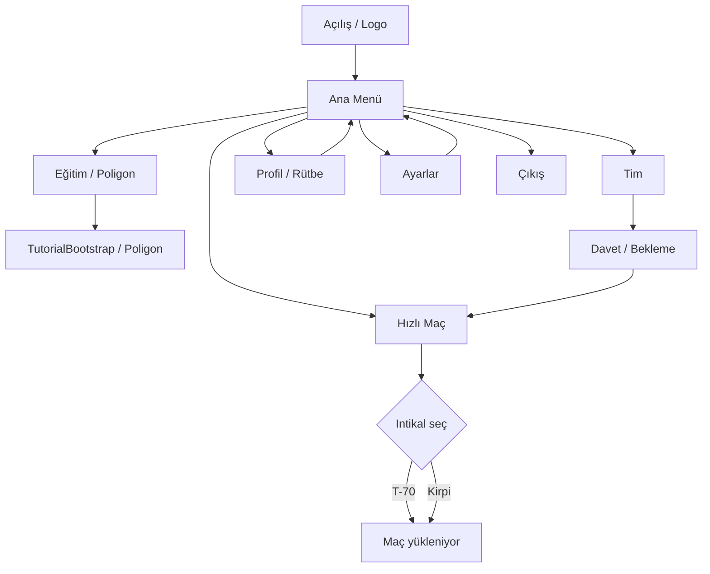
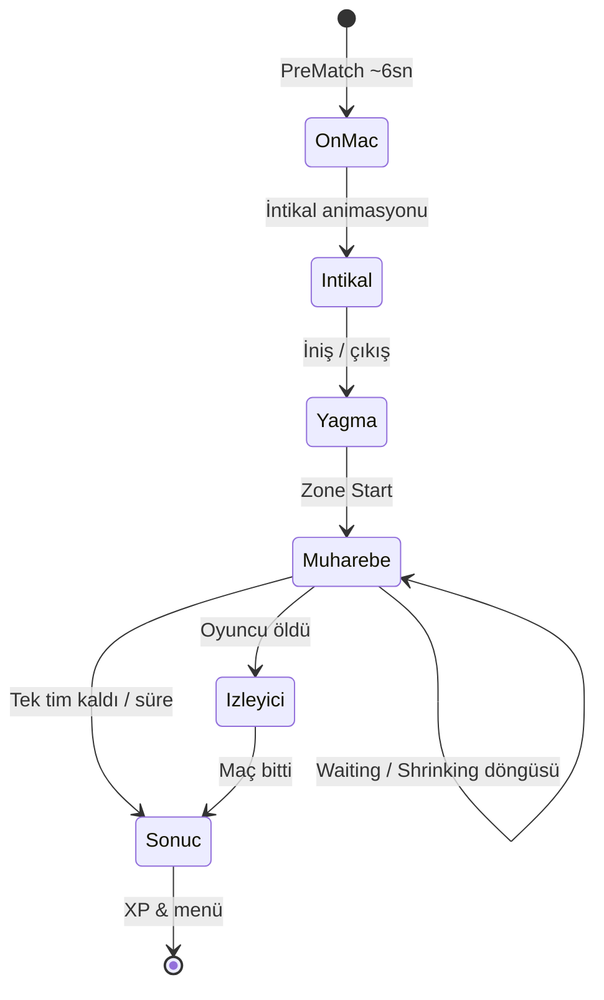
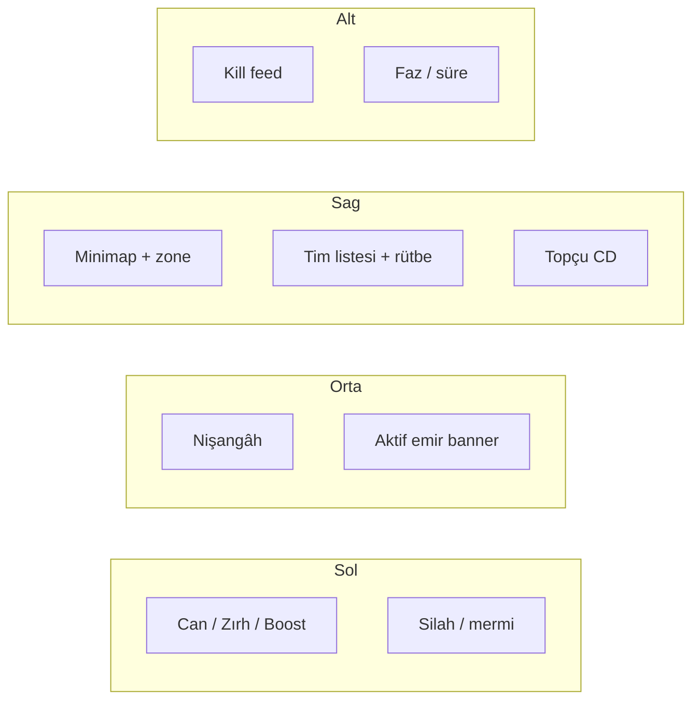
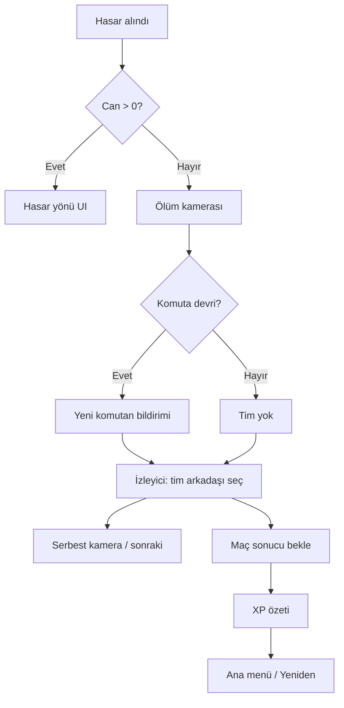
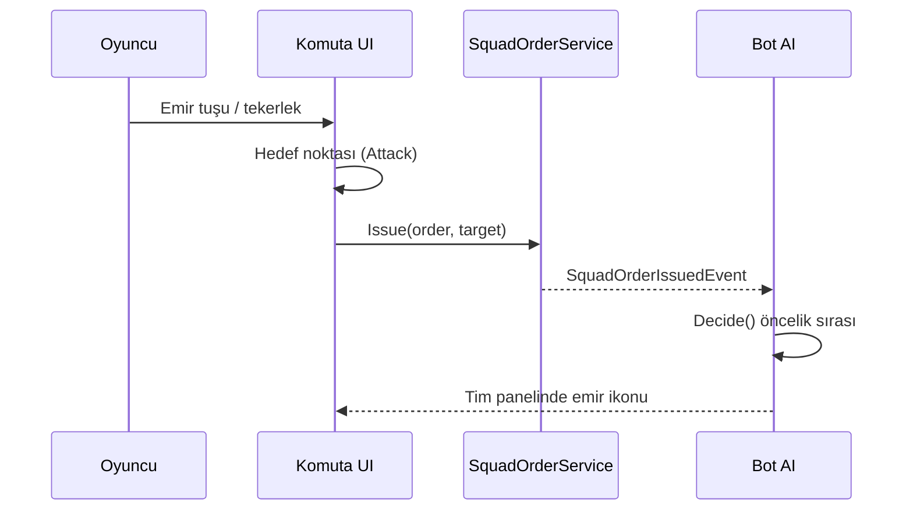
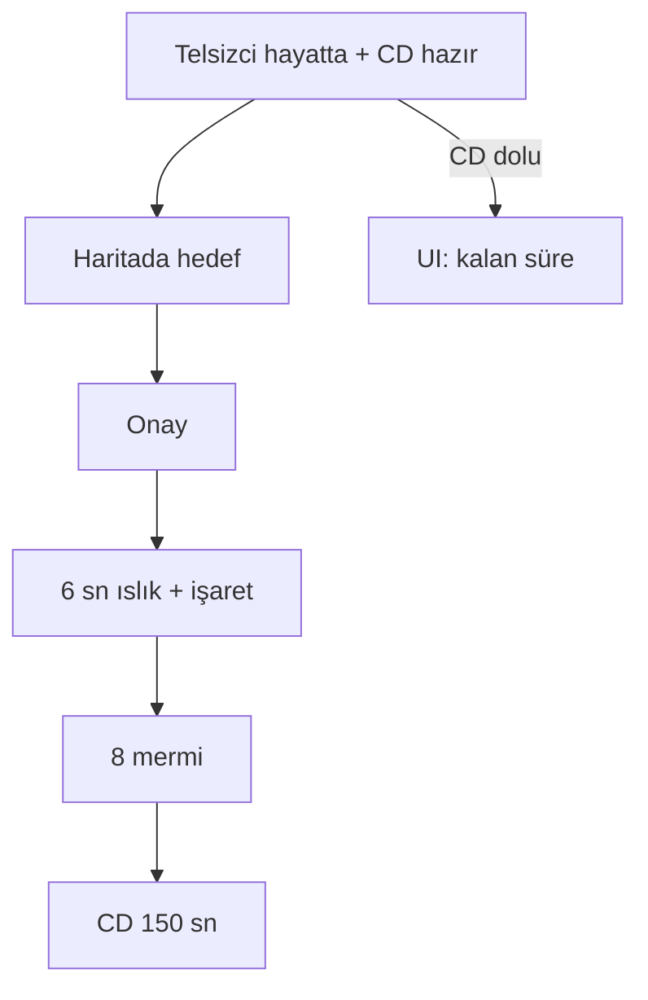

# U5. UI/UX Akış Diyagramları

Arayüz metinleri Türkçe. Diyagramlar Mermaid.

## 20.1 Ana menü

## 20.2 Maç akışı

## 20.3 Maç içi HUD bilgi mimarisi

## 20.4 Ölüm ve izleyici

## 20.5 Emir verme (komutan)

## 20.6 Topçu çağrısı

## 20.7 Erişilebilirlik notları

- Emir tekerleği: klavye sayıları + fare.  
- Zone: renk + süre metni + ses.  
- Ölüm ekranı: otomatik odak “Yeniden / Menü” (gamepad).
