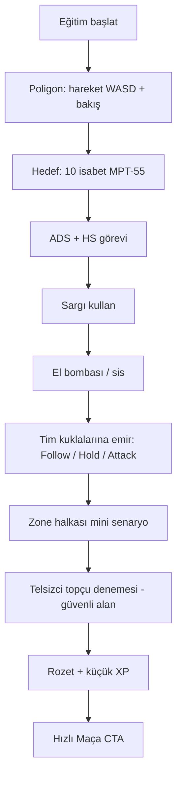

# U6. İlk 10 Dakika ve Eğitim (Tutorial)

Amaç: Yeni oyuncu **10 dakika içinde** hareket, ateş, yağma, emir ve zone kavramlarını öğrenir; “tim komutanı” fantezisine bağlanır.

## 21.1 İlk 10 dakika deneyimi (hızlı maç yolu)

| Dakika | Deneyim | Öğrenilen |
|--------|---------|-----------|
| 0:00–0:30 | Ana menü, “Hızlı Maç”, T-70 varsayılan | Giriş sürtünmesi düşük |
| 0:30–1:30 | İntikal, iniş Kuzgun Köyü yakını (yumuşak öneri) | Harita okuma |
| 1:30–3:00 | Yağma, ilk silah/mermi | Envanter |
| 3:00–5:00 | Tim Follow ile hareket; ilk temas veya uzak ateş sesi | Tim hissi |
| 5:00–7:00 | Beyaz çember + ZoneWarning | Zone |
| 7:00–10:00 | Emir tekerleği ipucu; sis veya topçu tooltips | Komuta |

**Başarı kriteri:** Oyuncu en az 1 emir verdi veya 1 iyileşme kullandı; menüye “ne oldu?” diyerek dönmedi.

## 21.2 Eğitim akışı (zorunlu değil, önerilir)

## 21.3 Atış poligonu görevleri

| Görev | Koşul | Ödül (tasarım) |
|-------|-------|----------------|
| Temel nişancı | 10 gövde isabeti / 60 sn | 50 XP |
| Kafa avcısı | 5 HS | 75 XP |
| Otomatik kontrol | MPT-55 ile 20 m hedefe %40+ isabet | 75 XP |
| Bolt ustası | JNG ile 3 isabet (hareketli hedef) | 100 XP |
| Saçma disiplini | Escort ile 8 m içi 2 kill kukla | 50 XP |
| Sargı altında | Hasar al, sargı ile 75’e çık | 50 XP |
| Komuta 101 | Hold → Attack sırası | 100 XP |
| Topçu tattırma | İşaretli alana çağrı (canlı mermi yok / düşük hasar) | 100 XP |

Günlük XP tavanı önerisi: **400** (spam önleme).

## 21.4 Tooltip / koç metinleri (TR)

- “Timine emir ver: **Takip / Mevzi / Taarruz / Toplan**.”  
- “Beyaz çember bir sonraki güvenli alan.”  
- “Telsizcin hayattaysa **topçu** çağırabilirsin.”  
- “Sargı 75 can tavanı; tam can için sıhhiye çantası.”  
- “Komutan düşünce komuta kıdemliye geçer.”

## 21.5 Tutundurma kancaları

1. İlk maç sonrası rütbe çubuğu animasyonu (Er → ilerleme).  
2. “Dün akşamki tatbikat” tarzı özet kartı (kill, emir, hayatta kalma).  
3. İkinci oturum CTA: “Kirpi ile dene” / “Eğitimdeki topçuyu gerçek maçta kullan”.

## 21.6 Ölçülecek olaylar

`tutorial_step_completed`, `first_order_issued`, `first_zone_damage`, `first_artillery_call`, `session_d1_return`.
