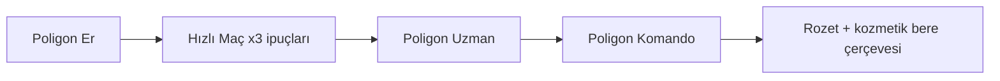

# UZATMA — Zorluk Parkuru: Er → Uzman → Komando

Poligon temel zinciri (`tutorial_steps.json`) üç zorluk profiliyle tekrar oynanır. Profil seçimi TrainingRange girişinde veya menü «Eğitim» altından.

İsimler rütbe / birlik esinli **kurgu etiketleridir** (`MilitaryRank.Er` ile karıştırılmamalı; Komando bir `MilitaryRank` değeri değildir).

---

## Ortak kurallar

| Kural | Açıklama |
|-------|----------|
| Adımlar | Aynı 18 adım kimliği; yalnızca eşikler, süre, ipucu yoğunluğu değişir |
| JSON alanı | `difficultyProfiles` (aşağıda) — Unity `tutorial_steps.json` ile birleştirir |
| Rozetler | `training_er`, `training_uzman`, `training_komando` |
| Kilitleme | Uzman: Er tamamlandı · Komando: Uzman tamamlandı (veya 5+ maç) |
| Canlı mermi | Er/Uzman: kukla · Komando: düşük hasarlı hareketli hedefler (dost ateşi kapalı) |

---

## Er (yeni asker)

Amaç: tuşları öğren, stres yok.

| Parametre | Değer |
|-----------|--------|
| Süre çarpanı | ×1.5 (tüm `timeLimitSeconds`) |
| İpucu | Her adımda ekran metni + sesli/yazılı ipucu sürekli |
| Hedef | Sabit; 25–100 m |
| İsabet eşiği | `poly_05` 3 isabet · `poly_06` 2 · `poly_07` 1 |
| Topçu | Otomatik hedef işaretli dilim; V yeterli |
| Kirpi | Düz şerit; 15 m sürüş yeterli |
| Başarısızlık | Süre dolunca ipucu yenilenir; adım sıfırlanmaz |
| XP | Adım XP ×0.75 (öğrenme odaklı) |

**Parkur notu:** Tim kuklaları F1–F4’e abartılı animasyonla yanıt verir (anlaşılırlık).

---

## Uzman (standart)

Amaç: temel zincirin birebir tekrarı — denge referansı.

| Parametre | Değer |
|-----------|--------|
| Süre çarpanı | ×1.0 (`tutorial_steps.json` değerleri) |
| İpucu | İlk 3 sn ekran metni; sonra yalnızca istenirse (H tuşu «ipucu») |
| Hedef | Sabit + 1 hareketli şerit (50–100 m) `poly_05`–`07` |
| İsabet eşiği | JSON’daki varsayılanlar |
| Topçu | Nişangâh veya harita işareti zorunlu |
| Kirpi | 25 m + hafif viraj |
| Başarısızlık | Süre dolunca adım yeniden başlar (3 deneme) |
| XP | ×1.0 |

---

## Komando (ileri)

Amaç: baskı altında komuta; maça hazırlık.

| Parametre | Değer |
|-----------|--------|
| Süre çarpanı | ×0.7 |
| İpucu | Kapalı (pause menü kılavuzu hariç) |
| Hedef | Hareketli + kısmi örtü; `poly_07` 200 m JNG zorunlu |
| İsabet eşiği | `poly_05` 8 · `poly_06` 5 (ADS) · `poly_07` 3 HS (`IsHeadshot: true`) |
| El bombası | Kukla örtü arkasında; sektirme gerekir |
| Emirler | 20 sn içinde Follow→Hold→Attack→Regroup sırası (`poly_15`+`16` birleşik zamanlayıcı) |
| Topçu | ±8 m isabet penceresi; `ArtilleryStrikeEvent` Impact en az 1 kukla hasarı |
| Kirpi | 40 m + engelli parkur; inmeden önce fren (hız &lt; 15 km/h) |
| Hasar | Oyuncuya eğitim peletleri (−5 HP); ölünce adım restart |
| Başarısızlık | 2 deneme; sonra Er önerisi CTA |
| XP | ×1.5 + rozet `training_komando` |

---

## JSON profil şeması (Unity birleştirme)

```json
{
  "difficultyProfiles": {
    "Er": {
      "id": "Er",
      "timeScale": 1.5,
      "hintMode": "always",
      "hitCountOverrides": {
        "poly_05_fire": 3,
        "poly_06_ads": 2,
        "poly_07_scope": 1
      },
      "vehicleMinDistanceMeters": 15,
      "xpMultiplier": 0.75,
      "badgeId": "training_er"
    },
    "Uzman": {
      "id": "Uzman",
      "timeScale": 1.0,
      "hintMode": "brief",
      "movingTargets": true,
      "vehicleMinDistanceMeters": 25,
      "xpMultiplier": 1.0,
      "badgeId": "training_uzman",
      "requires": "Er"
    },
    "Komando": {
      "id": "Komando",
      "timeScale": 0.7,
      "hintMode": "off",
      "movingTargets": true,
      "requireHeadshots": { "poly_07_scope": 3 },
      "orderComboSeconds": 20,
      "artilleryRequireImpactHit": true,
      "vehicleMinDistanceMeters": 40,
      "vehicleExitMaxSpeedKmh": 15,
      "trainingPelletDamage": 5,
      "xpMultiplier": 1.5,
      "badgeId": "training_komando",
      "requires": "Uzman"
    }
  }
}
```

Bu blok üretimde `tutorial_steps.json` köküne eklenebilir veya ayrı `tutorial_difficulty.json` olarak yüklenir.

---

## İlerleme ve CTA



- Er tamam → ana menü CTA: «Hızlı Maç»
- 3 maç ipuçları bitti → «Uzman parkuru»
- Komando rozeti → sezon kozmetik havuzuna **yalnızca görünüm** ödülü (pay-to-win yok)

## Kalite kontrol listesi

- [ ] 18 adım her profilde tamamlanabilir
- [ ] `SquadOrder` enum değerleri (`Follow` / `HoldPosition` / `Attack` / `Regroup`) birebir
- [ ] `ItemIds` (`bandage`, `grenade_frag`, `grenade_smoke`) katalogla uyumlu
- [ ] Topçu poligon CD’si `TrainingBootstrap.artilleryCooldownSeconds` (~25) ile uyumlu
- [ ] Kirpi `DrivableVehicle` + F etkileşimi
- [ ] Günlük XP tavanı 400 aşılmıyor (çoklu tekrar)
