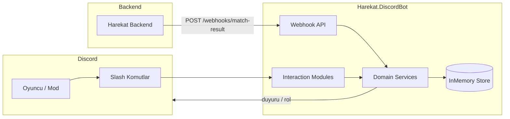

# HAREKÂT Discord Botu

.NET 10 + Discord.Net tabanlı bot. Slash komutları, maç sonucu webhook'u, sezon sıralaması, rütbe rol senkronu, tim toplama, moderasyon ve turnuva braketi sunar.

**Yalnızca bu klasör (`Tools/DiscordBot/`) değiştirilir.**

## Mimari



```
Tools/DiscordBot/
├── Harekat.DiscordBot.slnx
├── README.md
├── src/Harekat.DiscordBot/     # Bot + Minimal API
│   ├── Domain/                 # MilitaryRank, CareerStats, Tournament...
│   ├── Services/               # İş kuralları
│   ├── Modules/                # Slash komutları
│   ├── Webhooks/               # Backend → Discord
│   └── Hosting/                # Bot hosted service
└── tests/Harekat.DiscordBot.Tests/
```

## Ortam değişkenleri

| Değişken | Açıklama |
|----------|----------|
| `DISCORD_BOT_TOKEN` | Bot token (**zorunlu** Discord bağlantısı için) |
| `DiscordBot__GuildId` | Slash komutların kaydedileceği sunucu ID |
| `DiscordBot__AnnouncementChannelId` | Maç / haftalık duyuru kanalı |
| `DiscordBot__LogChannelId` | Moderasyon log kanalı |
| `DiscordBot__RankPromoChannelId` | Terfi duyuru kanalı |
| `DiscordBot__WebhookApiKey` | Webhook `X-Api-Key` değeri |

Token önceliği: `DISCORD_BOT_TOKEN` env → yapılandırma `Token` alanı.

Token yoksa bot Discord'a bağlanmaz; webhook ve servis katmanı yine de çalışır (test / yerel).

## Çalıştırma

```bash
cd Tools/DiscordBot
export DISCORD_BOT_TOKEN="your-token"
export DiscordBot__GuildId="123456789"
dotnet run --project src/Harekat.DiscordBot
```

Varsayılan HTTP: `http://localhost:5188`

## Slash komutlar

### Ana (GÖREV 6)
| Komut | Açıklama |
|-------|----------|
| `/siralama` | Genel XP sıralaması |
| `/profil <isim>` | Rütbe + CareerStats |
| `/tim` | Boş koltuğu olan timler |
| `/sunucu` | Dedicated sunucu durumu |

### Uzatmalar
| Komut | Açıklama |
|-------|----------|
| `/sezon` | Sezon sıralaması |
| `/haftalik-tim` | Haftalık en çok öldüren tim |
| `/tim-ara olustur\|katil\|liste` | 10 kişilik Discord tim toplama |
| `/mod uyari\|sustur\|ban\|log` | Moderasyon + log |
| `/turnuva olustur\|goster\|sonuc\|liste` | Braket + otomatik ilerleme |
| `/rutbe-senkron` / `/hesap-bagla` | Discord rol senkronu |
| `/terfi-simule` | XP + terfi bildirimi (admin) |
| `/bot-metrik` | Performans özeti |

## Webhook — maç sonu duyurusu

Backend maç bitince:

```http
POST /webhooks/match-result
X-Api-Key: dev-webhook-key
Content-Type: application/json

{
  "matchId": "match-42",
  "winningSquadName": "Bozkurtlar",
  "winningMembers": ["KomutanYilmaz", "KeskinNisanci"],
  "winningTeamKills": 28,
  "teamCount": 6,
  "mapName": "Kuzgun Vadisi",
  "xpGains": [
    { "playerId": "p-komutan", "xp": 1500 }
  ]
}
```

Terfi için ayrıca: `POST /webhooks/rank-promotion`

Sağlık: `GET /webhooks/health` · Metrik: `GET /webhooks/metrics`

## Rütbeler

`MilitaryRank` oyundaki enum ile birebir aynıdır:

Er → Onbasi → Cavus → SozlesmeliEr → UzmanOnbasi → UzmanCavus → AstsubayCavus → AstsubayKidemliCavus → AstsubayUstcavus → AstsubayKidemliUstcavus → AstsubayBascavus → AstsubayKidemliBascavus → Astegmen → Tegmen → Ustegmen → Yuzbasi → Binbasi → Yarbay → Albay

Discord rol adı: `HAREKÂT — Yüzbaşı` (Türkçe görünen ad).

## Test ve derleme

```bash
cd Tools/DiscordBot
dotnet build
dotnet test --settings coverlet.runsettings --collect:"XPlat Code Coverage"
```

Discord Interaction modülleri ve canlı Discord gateway katmanı (token gerektirir) coverage dışında tutulur; domain/servis/webhook katmanı %80+ hedeflenir.
## Discord Developer Portal

1. Application oluştur → Bot → token kopyala → `DISCORD_BOT_TOKEN`
2. OAuth2 URL Generator: `bot` + `applications.commands`
3. Privileged Gateway Intents: Server Members (rol senkronu için)
4. Botu sunucuya ekle; `GuildId` ve kanal ID'lerini ayarla
